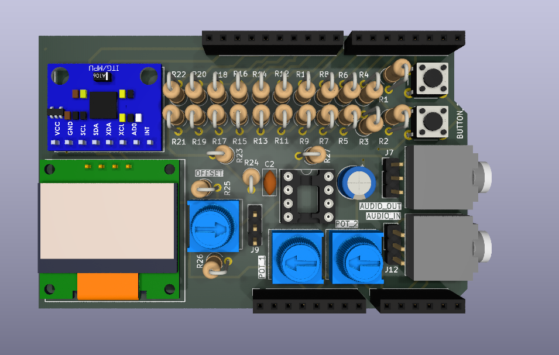
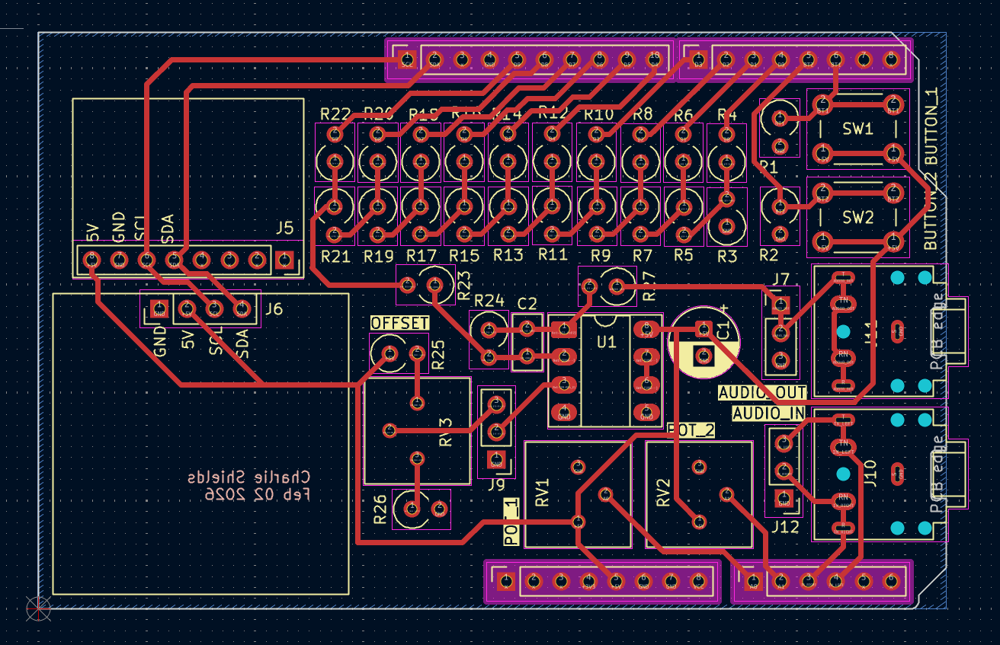
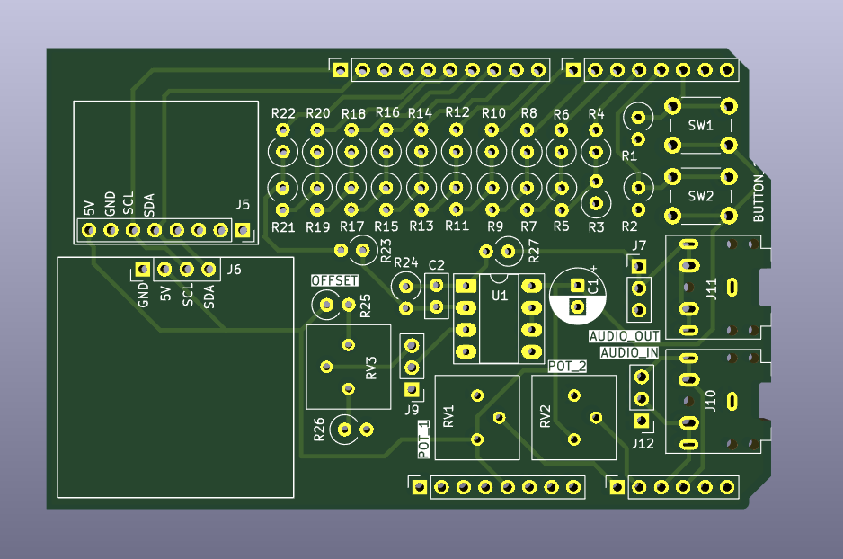
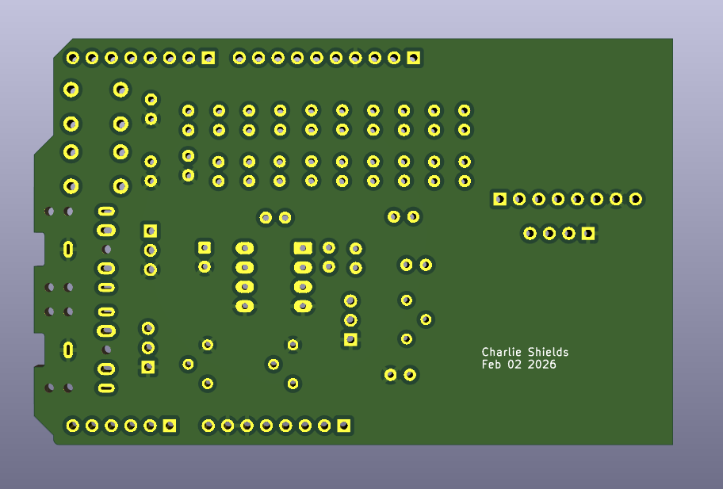

# Arduino UNO Shield PCB V1
See `Uno_Shield_DSP_Class_v1_SCH/` for the KiCad project files.

## Project Images

**3D View**:

**PCB Schematic**:

**PCB Board Front View**:

**PCB Board Back View**:

