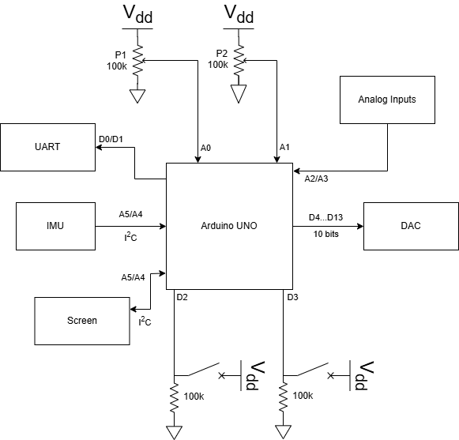
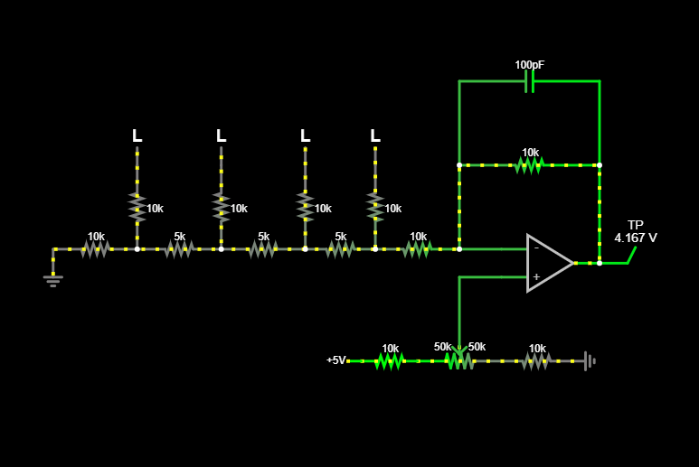
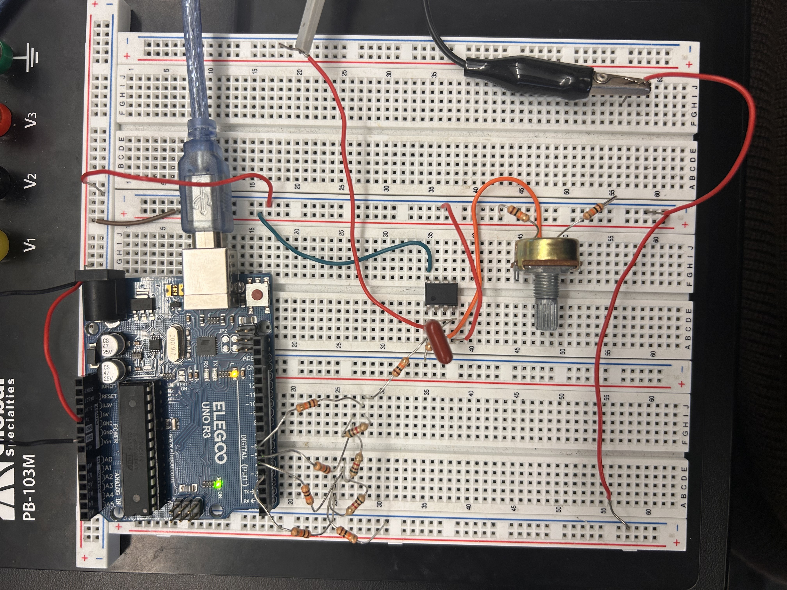
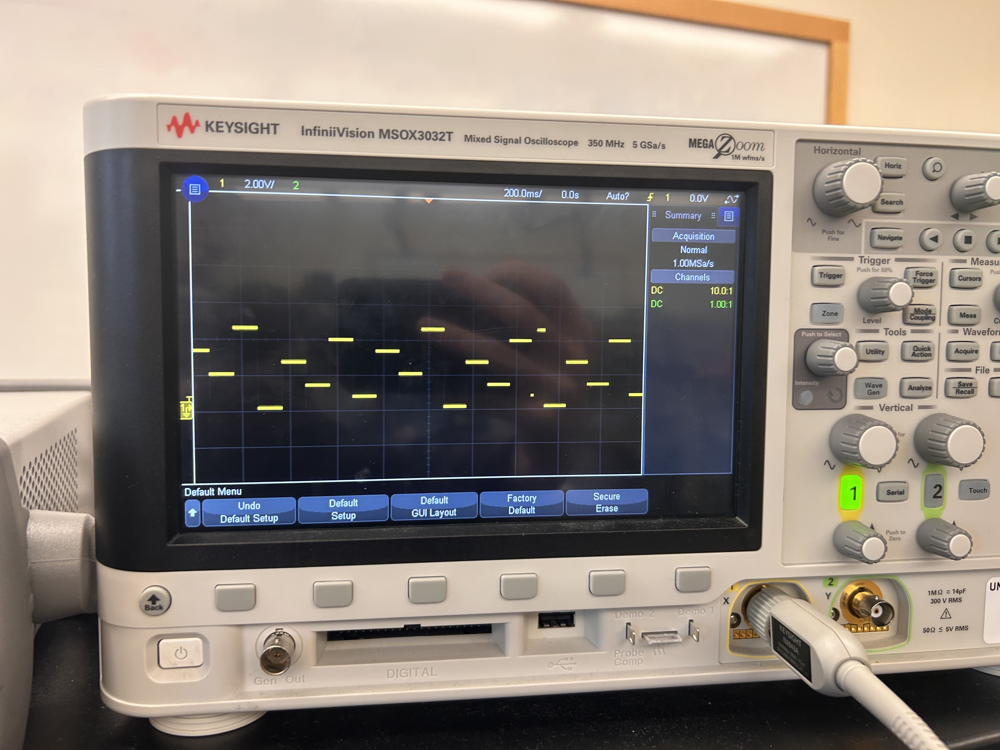
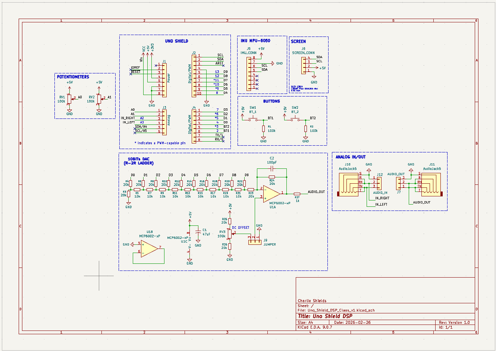
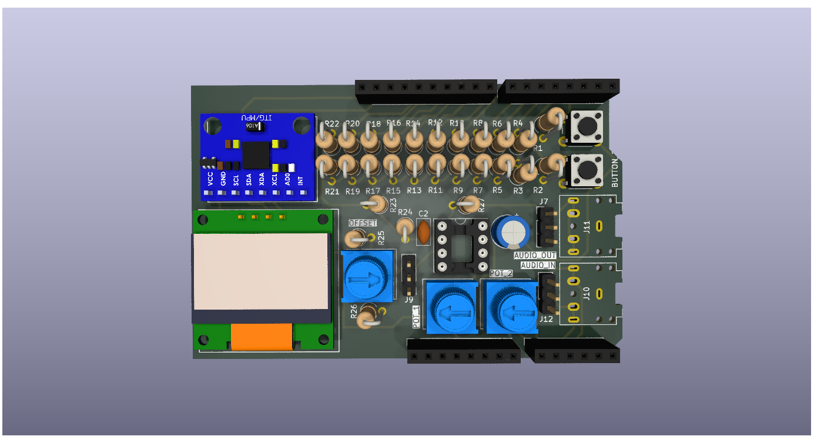
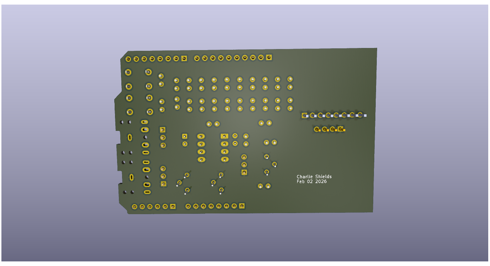
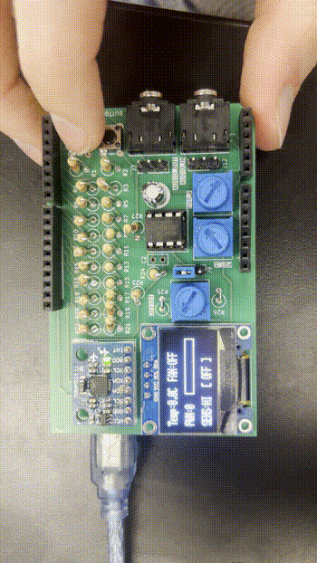
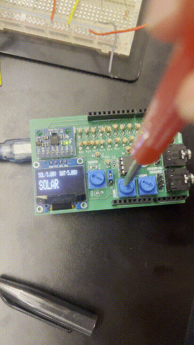

# Documentation C — DSP Shield

Charlie Shields | ENCE 3210 | University of Denver | Winter 2026

---

## Overview

The goal of this project is to design an Arduino UNO shield for learning embedded systems concepts including interrupt routines, timers, mixed signals (ADCs and DACs), and digital communications (I2C, SPI, and UART).

### Shield Specifications

| Feature | Detail |
|---|---|
| IMU | MPU6050 |
| Screen | SSD1306 0.96" OLED |
| DAC | 10-bit R-2R Ladder |
| Buttons | 2x Push Button (SW1, SW2) |
| Potentiometers | 3x 100kΩ Trim Pot (RV1, RV2, RV3) |
| Analog Inputs | AUDIO_IN, AUDIO_OUT |

---

## Block Diagram

  

---

## 10-bit R-2R Ladder DAC

### DAC Prototype (5-bit)

Before designing the full 10-bit DAC, a 5-bit R-2R ladder DAC was built and tested as a prototype.

- Arduino sets the DAC's 5 input bits to generate output voltage steps
- Output staircase waveform verified on oscilloscope
- Falstad simulation file: [`DAC_Prototype/circuit_5bit_r2r_daq`](../Documentation_B/DAC_Prototype/circuit_5bit_r2r_daq)

**Falstad Circuit Simulation:**

  

**Circuit Built in Lab:**

  

**Output Waveform:**

  

---

## KiCad PCB Design

KiCad project files: [`../Documentation_B/KiCad/`](../Documentation_B/KiCad/)

### Schematic

  

### PCB Layout

  

  
   <em>Front</em>

  
   <em>Back</em>

### 3D Rendering

  
   <em>Front</em>

  
   <em>Back</em>

### Interactive BOM

> ⚠️ The interactive BOM requires a browser to view. Click the link below or view the embedded version (works on GitHub and most markdown renderers).

🔗 [Open Interactive BOM](../Documentation_B/KiCad/Uno_Shield_DSP_Class_v1_Template_LAY/Uno_Shield_DSP_Class_v1/BOM/ibom.html)

<iframe 
  src="../Documentation_B/KiCad/Uno_Shield_DSP_Class_v1_Template_LAY/Uno_Shield_DSP_Class_v1/BOM/ibom.html" 
  width="100%" 
  height="600px" 
  style="border: 1px solid #ccc; border-radius: 4px;">
</iframe>

### Gerber Files

Gerber files for fabrication:
[`../Documentation_B/KiCad/Uno_Shield_DSP_Class_v1_Template_LAY/Uno_Shield_DSP_Class_v1/gerber/`](../Documentation_B/KiCad/Uno_Shield_DSP_Class_v1_Template_LAY/Uno_Shield_DSP_Class_v1/gerber/)

| File | Layer |
|---|---|
| `*-F_Cu.gbr` | Front Copper |
| `*-B_Cu.gbr` | Back Copper |
| `*-F_Mask.gbr` | Front Solder Mask |
| `*-B_Mask.gbr` | Back Solder Mask |
| `*-F_Silkscreen.gbr` | Front Silkscreen |
| `*-B_Silkscreen.gbr` | Back Silkscreen |
| `*-Edge_Cuts.gbr` | Board Outline |
| `*-PTH.drl` | Plated Through-Holes |
| `*-NPTH.drl` | Non-Plated Through-Holes |

---

## Shield Demos

### Fan Controller
> Fan speed controlled via PWM based on temperature/input readings. Full source code: [`lab4_firmware/fan_controller/`](../labs/lab4_firmware/fan_controller/fan_controller.ino)

  

### Solar Charge Controller
> Solar charge controller firmware running on the shield. Full source code: [`lab4_firmware/solar_charge_controller/`](../labs/lab4_firmware/solar_charge_controller/solar_charge_controller.ino)

  

