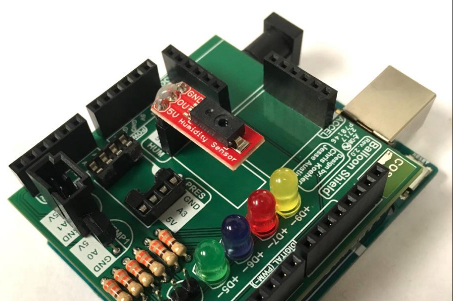
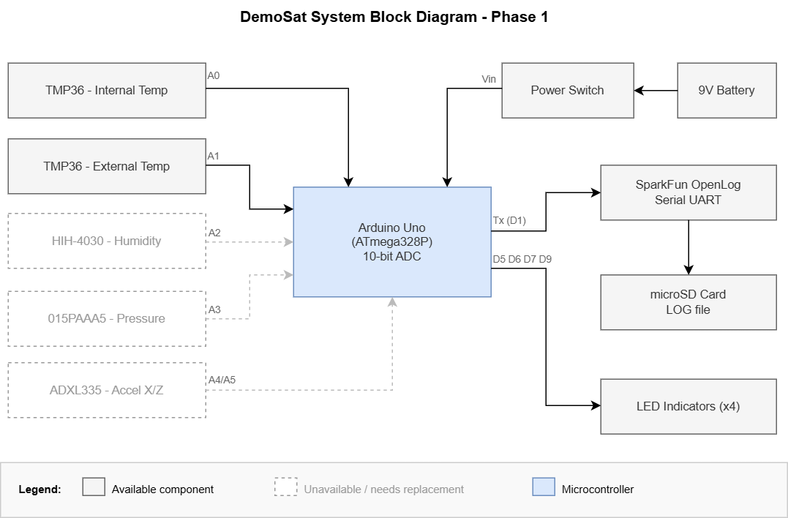
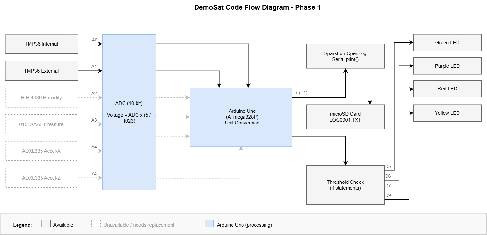
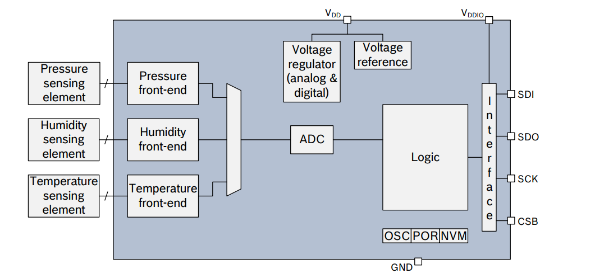

# Phase 1 - System Evaluation

**ENCE 3231 Microprocessors 1 | University of Denver | Winter Quarter 2026 | Charlie Shields**

---

## Table of Contents

1. [System Overview](#1-system-overview)
2. [Component Identification](#2-component-identification)
3. [Block Diagrams](#3-block-diagrams)
4. [Power Consumption Estimate](#4-power-consumption-estimate)
5. [Weight Estimate](#5-weight-estimate)
6. [Feasibility Assessment](#6-feasibility-assessment)

---

## 1. System Overview

The COSGC DemoSat kit is a modular Arduino-based payload designed for high-altitude balloon flights. It collects atmospheric and inertial data, stores it on a microSD card, and uses LEDs to provide visual system status.

*Completed DemoSat Balloon Shield mounted on Arduino Uno. Source: [COSGC Sensors Part 2 workshop slides](https://www.colorado.edu/center/spacegrant/sensors-part2-slides).*

---

## 2. Component Identification

All electronic components identified from the [COSGC sensor workshop materials](https://www.colorado.edu/center/spacegrant/sensors-part2-slides).

| Component | Part / Model | Interface | Arduino Pin(s) | Supply Voltage | Status |
| --- | --- | --- | --- | --- | --- |
| Microcontroller | Arduino Uno (ATmega328P) | - | - | 5V / 9V in | ✅ Available |
| Internal Temp Sensor | TMP36 | Analog | A0 | 5V | ✅ Available |
| External Temp Sensor | TMP36 | Analog | A1 | 5V | ✅ Available |
| Humidity Sensor | [Honeywell HIH-4030 (SparkFun SEN-09569)](https://www.newark.com/honeywell/hih-4030-001/humidity-sensor/dp/62M4608) | Analog | A2 | 5V | ❌ Retired by SparkFun |
| Pressure Sensor | [Honeywell ASDXACX015PAAA5](https://www.digikey.com/en/products/detail/honeywell-sensing-and-productivity-solutions/ASDXACX015PAAA5/2178290) | Analog | A3 | 5V | ❌ Not stocked - special order only, ~$35+/unit |
| Accelerometer (3-axis) | [ADXL335 (SparkFun SEN-09269)](https://www.adafruit.com/product/163?srsltid=AfmBOorSsPJjoM1Tb6bDJTxYjhdOy6JeGLzTG3ZLrxT3z4eOsSC37kzr) | Analog | A4 (X), A5 (Z) | 3.3V | ❌ Breakout ~$14.95 (Adafruit), ~$50 bare IC (DigiKey) |
| LED Indicators (4×) | Green, Purple, Red, Yellow LEDs | Digital | D5, D6, D7, D9 | 5V | ✅ Available |
| Data Logger | SparkFun OpenLog (microSD) | Serial UART | TX (D1) | 5V | ✅ Available (~$17.50) |
| Power Source | 9V alkaline battery | Power jack | VIN | 9V in | ✅ Available |
| Power Switch | Inline SPST switch | Series w/ battery | - | 9V | ✅ Available |
| Current-limiting Resistors (4×) | 330Ω, 1/4W through-hole | Passive | - | 5V | ✅ Available |

> **Note:** All 6 analog input pins (A0-A5) are fully occupied. Only 2 of the 3 accelerometer axes are connected (X on A4, Z on A5) - the Y-axis is isn't captured because there is no space left!

---

## 3. Block Diagrams

### System Block Diagram

### Code Flow Diagram

> Source files: [system_block_diagram.drawio](diagrams/system_block_diagram.drawio) | [code_flow_diagram.drawio](diagrams/code_flow_diagram.drawio)

---

## 4. Power Consumption Estimate

Current figures sourced from component datasheets.

| Component | Part | Supply | Current (datasheet) | Power (mW) | Notes |
| --- | --- | --- | --- | --- | --- |
| Arduino Uno (ATmega328P) | ATmega328P | 5V | ~46 mA | ~230 mW | Active mode |
| Internal Temp Sensor | TMP36 | 5V | ~0.05 mA | ~0.25 mW | |
| External Temp Sensor | TMP36 | 5V | ~0.05 mA | ~0.25 mW | |
| Humidity Sensor | [HIH-4030](https://www.pololu.com/file/0J324/HIH-4030-datasheet.pdf) | 5V | ~0.2 mA | ~1 mW | max 0.5 mA |
| Pressure Sensor | [ASDXACX015PAAA5](https://mm.digikey.com/Volume0/opasdata/d220001/medias/docus/575/ASDX.pdf) | 5V | ~2.5 mA | ~13 mW | max 3.5 mA |
| Accelerometer | [ADXL335](https://www.analog.com/media/en/technical-documentation/data-sheets/adxl335.pdf) | 3.3V | ~0.375 mA | ~1.2 mW | |
| LEDs ×4 (w/ 330Ω) | - | 5V | ~10 mA ea. | ~200 mW max | (5V − 2V) / 330Ω ≈ 9 mA; not all on simultaneously |
| SparkFun OpenLog | ATmega328 | 5V | ~5 mA avg | ~25 mW | 6 mA peak during write |
| **TOTAL** | | **5V rail** | **~72 mA (LEDs off) / ~112 mA (all LEDs on)** | **~308-508 mW** | |

### Battery Life Estimate

- Standard 9V alkaline battery capacity: ~550 mAh
- Arduino onboard linear regulator efficiency: ~80%
- Typical draw from battery at 9V: ~90 mA (LEDs mostly off during flight logging)
- Theoretical runtime: 550 / 90 ≈ **~6 hours**
- Realistic estimate for battery capacity: **3-5 hours**

---

## 5. Weight Estimate

| Component | Est. Weight |
| --- | --- |
| Arduino Uno | ~25 g |
| Balloon Shield PCB | ~15-20 g |
| TMP36 ×2 | ~1 g total |
| HIH-4030 humidity sensor | ~2 g |
| ASDXACX015PAAA5 pressure sensor | ~3 g |
| ADXL335 accelerometer | ~3 g |
| LEDs ×4 + 330Ω resistors ×4 | ~1 g |
| SparkFun OpenLog + microSD | ~5 g |
| 9V alkaline battery | ~45 g |
| Power switch + wiring (1ft) | ~8 g |
| **Electronics Total** | **~108-113 g** |

> The foam enclosure adds an estimated 30-50 g, bringing the total to **138-163 g** which is still within the 200g maximum.
---

## 6. Feasibility Assessment

### 6.1 Unavailable Components

| Component | Pin | Issue |
| --- | --- | --- |
| Honeywell HIH-4030 humidity sensor | A2 | Retired by SparkFun, $53,000 from Newark.com |
| Honeywell ASDXACX015PAAA5 pressure sensor | A3 | Not stocked at DigiKey, special order only at ~$35/unit |
| ADXL335 accelerometer | A4/A5 | Available as breakout board (~$14.95 Adafruit), but bare IC is ~$50 at DigiKey |

### 6.2 Design Limitations

- **Analog pin exhaustion** - all 6 analog pins occupied; no additional analog sensors can be added without hardware changes
- **Missing Y-axis acceleration** - only X (A4) and Z (A5) are captured; Y-axis is unused
- **No real-time clock (RTC)** - data is logged without timestamps; no time correlation for post-flight analysis
- **Linear regulator inefficiency** - ~20% of battery energy is lost as heat through the Arduino's onboard regulator

### 6.3 Conclusion

The core architecture (Arduino Uno + OpenLog + LEDs) remains viable and all those parts are available. However, the unavailability of the analog humidity and pressure sensors makes the current Sensor Kit non-reproducible as-is.

**My Recommendation:** Use a digital combined sensor like a **BME280** (pressure + humidity + temperature over I2C). This would:

- Resolve the availability issue
- Reduce component count
- Free up analog pins A2 and A3 for future use
- Stay well below the $147 and 200g constraints

*Block diagram of BME280 Source: [BMA150 Datasheet](https://cdn.sparkfun.com/assets/learn_tutorials/4/1/9/BST-BME280_DS001-10.pdf).*