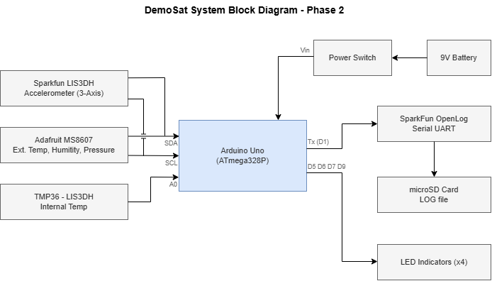
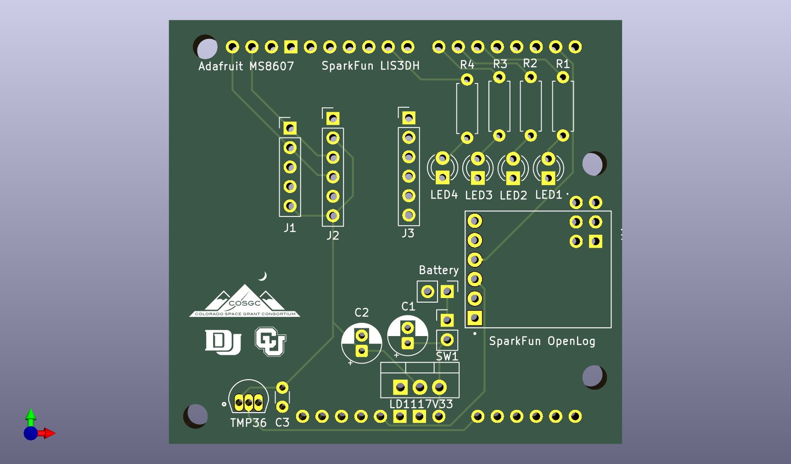
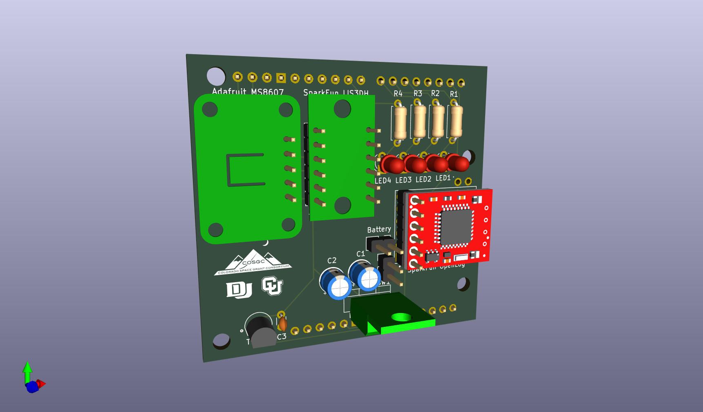

# Phase 2 - DemoSat PCB Design

**ENCE 3210 Microprocessors 1 | Winter Quarter 2026 | Final Project**
**Created by: Charlie Shields**

---

## Overview

This phase contains the final custom PCB design for the DemoSat project — a sensor data logging system built around an Arduino Uno (ATmega328P). The board interfaces with multiple sensors, logs data to a microSD card, and provides visual status indicators.

---

## System Block Diagram



---

## PCB Preview

### Front Silkscreen


### 3D Render


---

## System Architecture

The PCB acts as a shield/carrier board for the Arduino Uno and integrates the following components:

| Component | Function | Interface |
|---|---|---|
| SparkFun LIS3DH Breakout | 3-Axis Accelerometer | I2C (SDA/SCL) |
| Adafruit MS8607 | External Temp, Humidity, Pressure | I2C (SDA/SCL) |
| TMP36 | Internal Temperature Sensor | Analog (A0) |
| SparkFun OpenLog | Serial Data Logger → microSD | UART (TX/D1) |
| 4x LEDs (LED1–LED4) | Status Indicators | D5, D6, D7, D9 |
| LD1117V33 | 3.3V Voltage Regulator | Power |
| SW1 | Power Switch | — |
| 9V Battery Connector | Power Input | — |

---

## Repository Structure

```
Phase_2/
├── final_pcb/               # KiCad project files
│   ├── final_pcb.kicad_pcb  # PCB layout
│   ├── final_pcb.kicad_sch  # Schematic
│   ├── bom/
│   │   └── ibom.html        # Interactive BOM
│   ├── docs/
│   │   └── images/          # KiCad PCB Images
│   ├── gerber/              # Fabrication files
│   └── libraries/           # Custom footprints & symbols
│       ├── Adafruit MS8607/
│       ├── DEV-13712/
│       ├── SparkFun_LIS3DH-Breakout/
│       ├── TMP36GT9/
│       └── logos/           # COSGC, CU, DU logos
└── Final Presentation.pdf
```

---

## PCB Details

- **Layers:** 2 (F.Cu / B.Cu)
- **Connectors:** J1, J2, J3 (Arduino header passthrough)
- **Decoupling Caps:** C1, C2, C3
- **Current Limiting Resistors:** R1–R4 (for LEDs)
- **Mounting Holes:** 4x corners

---

## Tools Used

- [KiCad](https://www.kicad.org/) — Schematic & PCB design
- [draw.io](https://draw.io) — System block diagram
- Arduino IDE — Firmware development