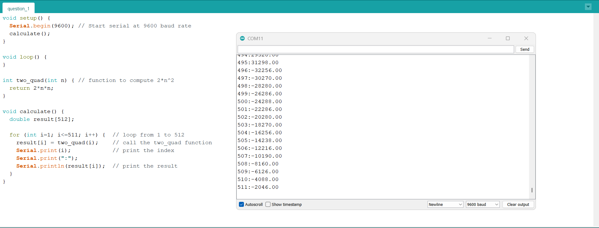
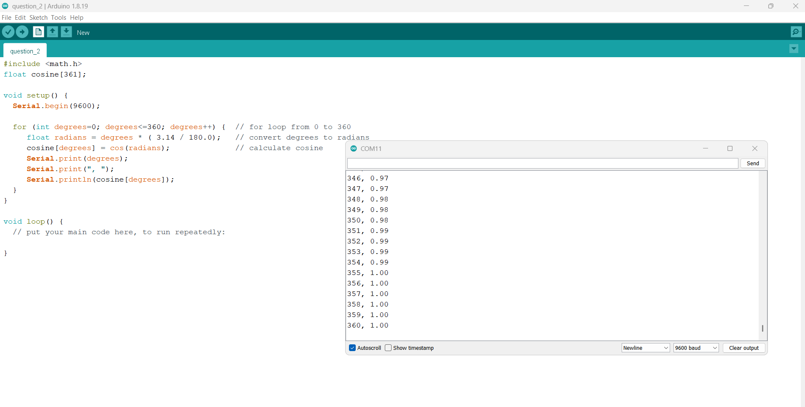
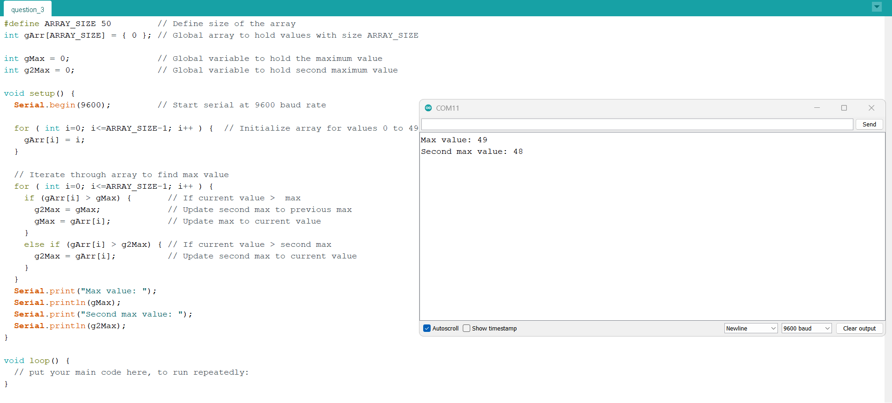
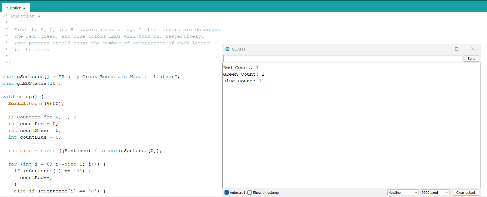
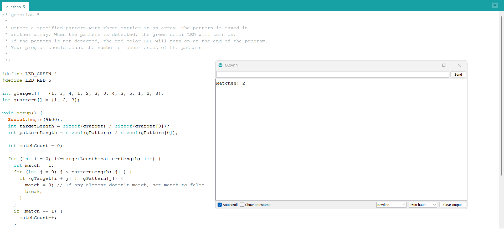

# Lab 1 - More C Practice

More exercises solved in C. Lab manual located in `Lab_1_Exercises.pdf`.

## Exercises

### 1. Calculate Twice the Square
**File:** `question_1/question_1.c`

Calculate twice the square of a given integer. Calculate twice the square of numbers between 0 and 511.

  

---

### 2. Cosine Calculation
**File:** `question_2/question_2.c`

Find the cosine of integer degrees between 0 and 360. The results are saved in an array.

  

---

### 3. Second Maximum in Array
**File:** `question_3/question_3.c`

Search for the second maximum value in a given integer array with 50 elements. The array is saved as a global variable. Write the result to the memory location just after the array ends.

  

---

### 4. RGB Letter Detection
**File:** `question_4/question_4.c`

Find the R, G, and B letters in an array. If the letters are detected, the red, green, and blue LEDs will turn on, respectively. The program counts the number of occurrences of each letter.

  

---

### 5. Pattern Detection
**File:** `question_5/question_5.c`

Detect a specified pattern with three entries in an array. The pattern is saved in another array. When the pattern is detected, the green LED turns on. If not detected, the red LED turns on at the end. The program counts the number of pattern occurrences.

  

---

### 6. LED Sequence Control
**Video Demo:** `images/question_6.mp4`

**File:** `question_6/question_6.c`

Turn on and off the red, green, and blue LEDs in a sequence with the following specifications:
- When the button is pressed, turn on the LEDs in the following order: **R → RG → RGB → GB → B → RB**
- This procedure repeats until the button is pressed again

  <video controls width="600">
    <source src="images/question_6.mp4" type="video/mp4">
    Your browser does not support the video tag.
  </video>

---

### 7. Simple Calculator 
**Video Demo:** `images/question_7.mp4`

**File:** `question_7/question_7.c`

A simple calculator with the following specifications:
- Three arrays, each with 10 elements (two with integer numbers, one empty for results)
- Button 1 pressed once: Addition operation (Red LED on)
- Button 1 pressed twice: Subtraction operation (Green LED on)
- Button 1 pressed three times: Multiplication operation (Blue LED on)
- Button 2 pressed: Apply selected operation to all array elements, save results to third array
- All LEDs turn off during operation
- All LEDs turn on when complete

  <video controls width="600">
    <source src="images/question_7.mp4" type="video/mp4">
    Your browser does not support the video tag.
  </video>

---
