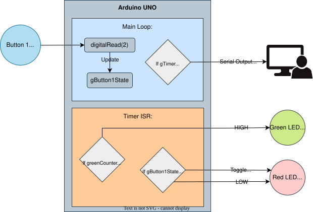

# Lab 3 — Asynchronous Tasks using Interrupt Timers

Concurrent task execution using hardware interrupt timers on the Arduino UNO.
Lab manual: `ENCE_3210_LAB_3.pdf`

---

## Overview

This lab demonstrates interrupt-driven concurrency with **volatile variables**, **GPIO**, and **hardware timers**.

- 2 background tasks (ISR-driven)
- 1 foreground task (main loop)

---

## Task Table

| Task | Frequency (Hz) | Timer | Responsibility |
|---|---|---|---|
| Task 1 | 1 Hz | Timer 1 | Blink Green LED @ 1 Hz; increment shared counter |
| Task 2 | 10 Hz | Timer 2 | Background async operation at 10 Hz |
| Main | — | — | Foreground logic; uses Task 1 counter as a software timer |

---

## R-2R DAQ Circuit

A **5-bit R-2R resistor ladder DAC** was designed, simulated, and built as part of this lab.

- Falstad simulation included
- Arduino sets DAC input bits to generate a staircase waveform
- Output verified on oscilloscope

See [`Documentation_B/DAC_Prototype/`](../Documentation_B/DAC_Prototype/README.md) for full circuit details.

### Block Diagram

  

