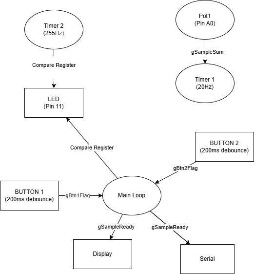

# Lab 4 — Firmware Engineering

Firmware design and implementation exercises.
Full lab report: `Lab_4.pdf`

---

## Exercise 2 — Solar Charger

Firmware for a solar-powered battery charging control system.

**Demo:**
<video width="640" height="480" controls>
  <source src="solar_charger.mp4" type="video/mp4">
  Your browser does not support the video tag.
</video>

---

## Exercise 4 — Fan Controller

PWM-based fan speed controller with sensor feedback.

**Block Diagram:**

**Demo:**
<video width="640" height="480" controls>
  <source src="fan_controller.mp4" type="video/mp4">
  Your browser does not support the video tag.
</video>